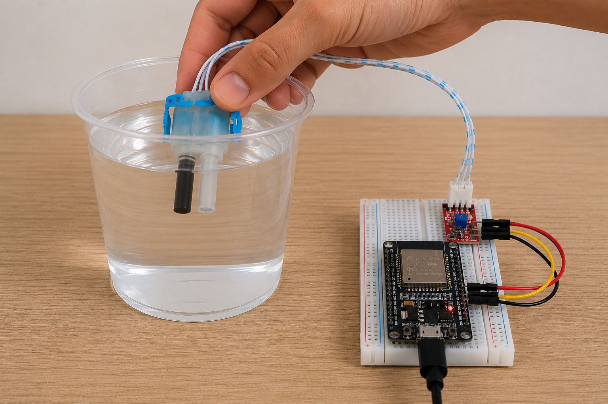

# Dados

Esta pasta reúne os arquivos CSV usados nos testes experimentais de turbidez do HidroAlerta. Os dados registram leituras de um módulo sensor de turbidez conectado a um ESP32 WiFi DevKit V1, usando amostras de água limpa e água misturada com diferentes quantidades de terra peneirada.

O objetivo desta etapa foi caracterizar experimentalmente o comportamento do sensor sob diferentes concentrações relativas de partículas suspensas. Os dados ainda não representam valores calibrados em NTU.

## Sensor utilizado



## Documentação

- [METODOLOGIA.md](./METODOLOGIA.md): explica o princípio físico da medição, o delineamento experimental, as variáveis, a repetibilidade e as limitações.
- [CODIGO_COLETA.md](./CODIGO_COLETA.md): contém o código usado no ESP32 para gerar os CSVs.

## Organização

```text
Dados/
├── agua_limpa/             # Amostras de referência, sem adição de terra
├── 1_2_colher_de_cha/      # Água com 1/2 colher de chá de terra
├── 1_colher_de_cha/        # Água com 1 colher de chá de terra
├── 2_colheres_de_cha/      # Água com 2 colheres de chá de terra
├── sensor.png              # Imagem do sensor usado nos experimentos
├── README.md               # Visão geral dos dados
├── METODOLOGIA.md          # Explicação técnica e experimental
└── CODIGO_COLETA.md        # Código usado no ESP32
```

## Arquivos disponíveis

| Pasta | Amostra | Arquivos |
| --- | --- | --- |
| `agua_limpa` | `agua_limpa` | `agua_limpa_teste_1.csv`, `agua_limpa_teste_2.csv` |
| `1_2_colher_de_cha` | `agua_pouca_terra` | `agua_pouca_terra_teste_1.csv`, `agua_pouca_terra_teste_2.csv` |
| `1_colher_de_cha` | `agua_media_terra` | `agua_media_terra_teste_1.csv`, `agua_media_terra_teste_2.csv` |
| `2_colheres_de_cha` | `agua_alta_terra` | `agua_alta_terra_teste_1.csv`, `agua_alta_terra_teste_2.csv` |

Cada pasta possui dois testes independentes para a mesma condição experimental.

## Colunas dos CSVs

Os arquivos foram gerados pela porta serial do ESP32 em formato CSV. Cada linha representa uma leitura consolidada a partir da média de 50 amostras analógicas do sensor.

| Coluna | Descrição |
| --- | --- |
| `leitura` | Número sequencial da leitura registrada. |
| `tempo_ms` | Tempo acumulado da coleta em milissegundos. |
| `amostra` | Identificação da condição da água testada. |
| `adc_medio` | Valor médio das 50 leituras do conversor analógico-digital. |
| `adc_menor` | Menor valor ADC observado nas 50 leituras. |
| `adc_maior` | Maior valor ADC observado nas 50 leituras. |
| `tensao_media_v` | Tensão média calculada a partir do `adc_medio`. |

## Interpretação inicial

- `agua_limpa` representa a condição de referência.
- `agua_pouca_terra` representa baixa presença de terra na água.
- `agua_media_terra` representa presença intermediária de terra.
- `agua_alta_terra` representa maior presença de terra.

Os dados devem ser usados para comparar a resposta elétrica do sensor entre condições experimentais. Nesta etapa, valores maiores ou menores de ADC/tensão indicam mudança relativa na resposta do sensor, mas não devem ser interpretados como medições absolutas de turbidez em NTU.

## Observações de formato

Alguns arquivos foram exportados com a linha principal do CSV entre aspas. Ao importar em scripts ou planilhas, confira se as colunas foram separadas corretamente por vírgula.

Uma melhoria futura possível é adicionar a condição experimental como metadado estruturado:

```text
leitura,tempo_ms,amostra,adc_medio,adc_menor,adc_maior,tensao_media_v,quantidade_terra
```
